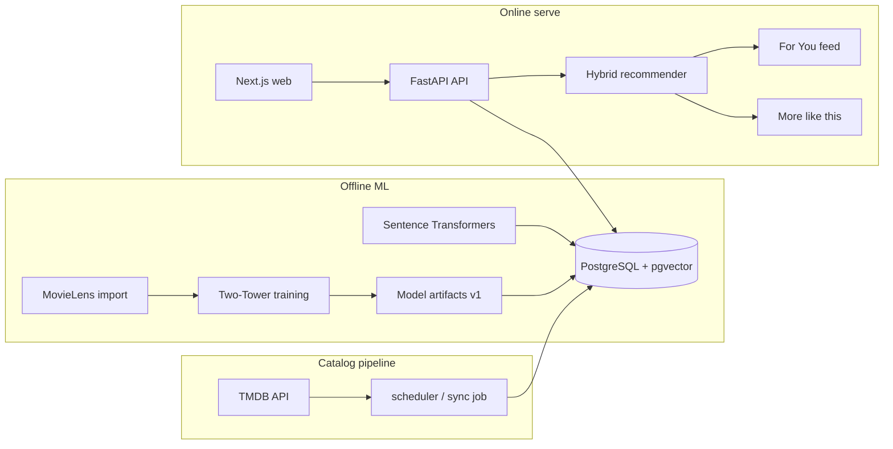

# StreamWise

**StreamWise** is a movie and series discovery platform with hybrid ML recommendations, vector search, TMDB live catalog, user auth, and Brazil streaming availability.

## Quick start (Docker)

Requires only **Docker** and **Docker Compose** — no local Python venv or npm install.

```bash
cp infra/.env.example infra/.env
# Edit infra/.env — set TMDB_API_KEY and JWT_SECRET

make init
```

Open:

- Web: http://localhost:3000
- API: http://localhost:8000/docs

### Commands

| Command | Description |
|---|---|
| `make init` | First-time bootstrap (up + TMDB sync) |
| `make up` | Start all services |
| `make down` | Stop services |
| `make sync` | Manual TMDB catalog sync |
| `make test-api` | Run API tests in container |
| `make eval` | Run offline ML evaluation (MovieLens holdout) |
| `make logs` | Tail container logs |

## Architecture

End-to-end data and serving flow:



Container topology (Docker Compose):

```text
postgres ──► migrate (one-shot) ──► api ──► web
                  │                  ▲
                  └──► scheduler ────┘
                  └──► sync (one-shot, profile init)
```

## API usage

The REST contract is defined in [specs/001-streamwise/contracts/openapi.yaml](specs/001-streamwise/contracts/openapi.yaml).

Interactive docs: http://localhost:8000/docs (when the stack is running).

Common authenticated flows:

| Flow | Endpoints |
|---|---|
| Auth | `POST /auth/register`, `POST /auth/login`, `GET /users/me` |
| Onboarding | `PUT /users/me/preferences`, `GET /catalog/genres`, `GET /catalog/providers` |
| Discovery | `GET /catalog/trending`, `GET /catalog/new`, `GET /catalog/search` |
| Personalization | `GET /recommendations/for-you`, `GET /titles/{id}/similar` |
| Interactions | `POST /titles/{id}/interactions` |
| Profile | `GET /users/me/likes`, `GET /users/me/watchlist`, `GET /users/me/affinity` |

All user-specific routes require `Authorization: Bearer <access_token>`.

## ML evaluation (SC-007)

Offline quality gate scripts live under `ml/eval/`. They compare **popularity**, **content-only (genre/pgvector proxy)**, and **Two-Tower** baselines on a MovieLens holdout set.

```bash
# 1) Import MovieLens (host Python 3.11+ with ml/training deps)
cd ml/training && pip install -e .
python import_movielens.py --output-dir ../../ml/artifacts/movielens

# 2) Optional: train Two-Tower for the collaborative baseline
python train_two_tower.py --config config.yaml

# 3) Run evaluation from repo root
python ml/eval/evaluate.py

# 4) Optional: publish metrics JSON to model_versions
python ml/eval/evaluate.py --publish --with-db-checks
```

Or via Make (uses the API container Python environment):

```bash
make eval
```

### Metrics results

> Replace placeholders below after running `make eval` on your machine.

| Baseline | Precision@10 | Recall@10 | NDCG@10 | Coverage |
|---|---:|---:|---:|---:|
| popularity | 0.0040 | 0.0398 | 0.0169 | 0.0031 |
| content_only | 0.0004 | 0.0036 | 0.0019 | 0.0271 |
| two_tower | _Run training_ | — | — | — |

_Last run: MovieLens latest-small holdout (553 users). Re-run `make eval` after training for Two-Tower numbers._

**Quality gates**

| Criterion | Target | Status |
|---|---|---|
| SC-007 — content/hybrid beats popularity (NDCG@10) | Yes | _Run eval_ |
| SC-004 — platform affinity in top-10 For You | ≥60% users | _Run with `--with-db-checks`_ |
| SC-005 — genre overlap in More like this | ≥70% titles | _Run with `--with-db-checks`_ |
| SC-006 — daily TMDB sync success | ≥95% | Logged by scheduler |

Latest eval JSON: `ml/artifacts/eval/metrics.json` (also merged into `model_versions.metrics` when published).

## Documentation

| Resource | Description |
|---|---|
| [specs/001-streamwise/quickstart.md](specs/001-streamwise/quickstart.md) | Full Docker workflow |
| [specs/001-streamwise/contracts/openapi.yaml](specs/001-streamwise/contracts/openapi.yaml) | OpenAPI contract |
| [docs/STREAMWISE-PLANNING.md](docs/STREAMWISE-PLANNING.md) | Product and architecture planning |
| [specs/001-streamwise/plan.md](specs/001-streamwise/plan.md) | Implementation plan |
| [.specify/memory/constitution.md](.specify/memory/constitution.md) | Project governance |

## Monorepo layout

```text
apps/api/     FastAPI REST backend
apps/web/     Next.js frontend
ml/training/  Offline training pipelines
ml/eval/      Offline metrics and quality gates
jobs/         Background jobs (TMDB sync)
infra/        Docker Compose and env templates
legacy/       Original course e-commerce TF.js demo
specs/        Spec Kit artifacts
```

## Legacy demo

The original **E-commerce Recommendation System** (TensorFlow.js) lives in [`legacy/`](legacy/).

## Branch

Active feature branch: `001-streamwise`
