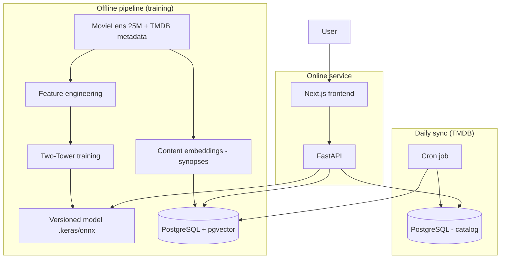

# StreamWise — Planning Document

> Personalized movie and series discovery and recommendation platform.  
> Document compiled from the initial project planning (restructuring the e-commerce TensorFlow.js example into a professional portfolio product).

---

## Table of Contents

1. [Overview](#1-overview)
2. [Origin and motivation](#2-origin-and-motivation)
3. [What the platform does](#3-what-the-platform-does)
4. [User flows](#4-user-flows)
5. [System architecture](#5-system-architecture)
6. [ML model and recommendation](#6-ml-model-and-recommendation)
7. [Datasets and data pipelines](#7-datasets-and-data-pipelines)
8. [External APIs](#8-external-apis)
9. [Data model (tables and relationships)](#9-data-model-tables-and-relationships)
10. [Suggested tech stack](#10-suggested-tech-stack)
11. [Screens and experience (UI)](#11-screens-and-experience-ui)
12. [Implementation roadmap](#12-implementation-roadmap)
13. [Enhancements and extra features](#13-enhancements-and-extra-features)
14. [P0 / P1 / P2 prioritization](#14-p0--p1--p2-prioritization)
15. [Success metrics](#15-success-metrics)
16. [Resume and positioning](#16-resume-and-positioning)
17. [Evolution from the current project](#17-evolution-from-the-current-project)
18. [Spec Kit workflow](#18-spec-kit-workflow)
19. [Explicitly out of scope](#19-explicitly-out-of-scope)
20. [References](#20-references)

---

## 1. Overview

**StreamWise** is a movie and series discovery hub — not a video player. The platform answers the question:

> *"What should I watch now, where is it available, and why does it fit me?"*

### Value proposition

| For the user | For learning / portfolio |
|---|---|
| See what's trending and newly released | Real data pipeline (ETL + cron) |
| Rate and like titles | Hybrid recommender systems |
| Receive a personalized feed | Neural networks (Two-Tower) + vector DB |
| Know which streaming service to use | ML metrics (Precision@K, NDCG) |
| Understand why something was suggested | Separate train/serve architecture |

### Positioning

- **Type:** web platform with login, live catalog, and ML-powered feed
- **Domain:** movies and series (film + TV)
- **Initial region:** Brazil (`country_code = BR` for TMDB providers)
- **Differentiator:** recommendations that consider **taste + inferred streaming platform** from likes

---

## 2. Origin and motivation

### Previous project (course)

The original repository was an **e-commerce** recommendation system with:

- Vanilla JS frontend (MVC: view, controller, service)
- TensorFlow.js in a Web Worker
- Sequential neural network (128 → 64 → 32 → 1, sigmoid)
- Manual features: category, color, price, age (one-hot + normalization)
- **In-browser** training with static JSON (`users.json`, `products.json`)
- Prediction: concatenate user vector + product vector → score 0–1

The code already contained the production insight:

> *"Store vectors in a vector database, fetch top-N candidates, run the model only on those."*

### Restructuring goal

Transform the educational exercise into a **professional portfolio project** that demonstrates:

1. Understanding of **neural networks applied to recommendation**
2. **Vector database** (pgvector) for semantic retrieval
3. **Robust dataset** (MovieLens) + live operational catalog (TMDB)
4. **Per-user personalization** (profile, likes, streaming affinity)
5. **Metrics and documentation** for ML engineering

### Why movies/series (and not e-commerce)

| Criterion | Movies/series | E-commerce |
|---|---|---|
| Public datasets | MovieLens (25M ratings) | Amazon Reviews (ok, but saturated) |
| Recognition | Netflix/JustWatch style | Common in tutorials |
| Rich features | Genre, synopsis, cast, streaming | Price, category |
| Natural cold start | Genre onboarding | Less intuitive |
| Vector search | Synopses → semantic embeddings | Less impactful |

---

## 3. What the platform does

### Functional pillars

| Pillar | Behavior |
|---|---|
| **Live catalog** | Daily job syncs trending, releases, and on-air series via TMDB |
| **Discovery** | Logged-in user sees "Trending", "New releases", "On air this week" |
| **Light social** | StreamWise community average rating + like count |
| **Interaction** | Like, dislike, 1–5 rating, "want to watch", "already watched" |
| **Personalized feed** | Suggestions based on likes, history, and streaming affinity |
| **Practical filter** | "Only show me what's on Netflix" (Prime, Disney+, Max…) |
| **Explainability** | Reason tags on each suggestion ("Sci-Fi like Interstellar") |

### What StreamWise is **not**

- Does not play video
- Does not replace Netflix, Prime, or Disney+
- Not a full JustWatch clone (MVP focused on discovery + ML)

---

## 4. User flows

### 4.1 Main flow (returning user)

```
1. Login / sign up
2. Home:
   - "Trending today" (global, TMDB)
   - "New releases" (global)
   - "For you" (personalized, ML model)
3. Click a title → synopsis, StreamWise rating, streaming badges
4. LIKE or rate → interaction saved
5. "For you" feed updates:
   - titles similar in genre/theme (content-based)
   - titles liked by similar users (collaborative)
   - prioritizes platforms where the person tends to watch
```

### 4.2 Cold start (new user)

Without a long interaction history:

1. Global trending (TMDB)
2. Onboarding: choose **favorite genres**
3. Onboarding: "Which streaming services do you use?" (Netflix, Prime…)
4. Optional: mark 3–5 titles already seen/liked
5. Initial feed via vector search by profile + boost for declared platforms

### 4.3 Search and similarity

```
User clicks "More like this" or searches by text
  → embedding of the title or query
  → vector search in catalog (cosine similarity)
  → neural rerank (optional)
  → ordered list
```

### 4.4 Training (offline — not in the UI)

```
Periodically (weekly or after N new interactions):
  MovieLens + StreamWise interactions
    → retrain Two-Tower
    → update embeddings in pgvector
    → new model version (model_versions)
```

---

## 5. System architecture

### 5.1 Macro view



### 5.2 Recommendation layers

| Layer | Technique | Role |
|---|---|---|
| **1 — Retrieval** | Vector search (pgvector, cosine) | Top ~200 fast candidates |
| **2 — Ranking** | Two-Tower neural network | User × title compatibility score |
| **3 — Reranking** | Streaming boost + MMR diversity | Final feed score |
| **4 — Explainability** | Rules over genre/platform/history | Tags on cards |

### 5.3 Train / serve pattern

| Phase | Where it runs | Responsibility |
|---|---|---|
| **Training** | Python + TensorFlow/Keras (offline) | Learn patterns from MovieLens + StreamWise likes |
| **Inference** | FastAPI (online) | Retrieval + ranking + rerank |
| **Catalog sync** | Cron/worker (daily) | TMDB → PostgreSQL + embeddings |

The user **does not train the model in the browser**. They consume recommendations from a pre-trained model.

---

## 6. ML model and recommendation

### 6.1 Conceptual evolution (course project → StreamWise)

| Aspect | Course project | StreamWise |
|---|---|---|
| Approach | MLP: concat(user, item) → sigmoid | Two-Tower: user_vec · item_vec |
| Training | Browser, real-time | Offline, versioned pipeline |
| Features | Manual one-hot (color, category) | Embeddings + genres + synopsis + streaming |
| Retrieval | Brute force over all products | pgvector top-K → rerank |
| Dataset | Small JSON | MovieLens 25M + TMDB + real interactions |

### 6.2 Main model: Two-Tower

```
                    ┌─────────────────┐
  History +         │   USER TOWER    │──→ user vector (64 dims)
  profile + genres  │  (dense network)│
  stream affinity   └─────────────────┘
                              │
                              │  score = similarity
                              │  (dot product / cosine)
                              ▼
                    ┌─────────────────┐
  Genres + year +   │   ITEM TOWER    │──→ title vector (64 dims)
  synopsis + stream │  (dense network)│
                    └─────────────────┘
```

#### User Tower — inputs

| Feature | Source |
|---|---|
| User embedding | ID + MovieLens history (training) |
| Recent likes | `interactions` |
| Preferred genres | `user_preferences` + likes |
| Streaming affinity | `user_streaming_affinity` |
| "Tonight" context (P1) | available time, mood, company |

#### Item Tower — inputs

| Feature | Source |
|---|---|
| Title embedding | ID + MovieLens |
| Genres, year | `titles` + `title_genres` |
| Synopsis embedding | `title_embeddings.content_vector` |
| Platforms (multi-hot) | `title_streaming_providers` |

### 6.3 Hybrid inference (2 stages)

**Stage 1 — Candidates (fast)**

- Vector search: titles similar to those that received a like
- Filter: exclude already watched / disliked
- Boost: same platform as recent likes

**Stage 2 — Ranking (precise)**

- Two-Tower computes score for each candidate (~200)
- Rerank with streaming affinity
- MMR for diversity (P1)
- Top 10–20 for the feed

### 6.4 Streaming affinity

#### Explicit (onboarding)

User declares: "I use Netflix and Prime" → filter or boost on those platforms.

#### Implicit (inferred from likes)

```
User liked:
  - Stranger Things  → Netflix
  - The Boys         → Prime
  - Dune             → Max

System calculates:
  Netflix: 0.45
  Prime:   0.35
  Max:     0.20
```

Stored in `user_streaming_affinity`. Used in ranking:

```
score_final = score_model × (1 + α × streaming_affinity)
```

(α configurable, e.g.: 0.3)

### 6.5 Training

#### Training example (user, title pair)

| Field | Source | Example |
|---|---|---|
| `user_id` | MovieLens / StreamWise | 42 |
| `title_id` | MovieLens / TMDB | 8810 |
| `label` | rating ≥ 4 → 1; rating ≤ 2 → 0 | 1 |
| User features | aggregated history | embedding |
| Title features | genres, synopsis, streaming | item vector |

- **Loss:** binary crossentropy (like/dislike) or MSE (rating 1–5)
- **Validation:** holdout by users not seen during training

### 6.6 Prediction vs. suggestion

| Concept | Definition |
|---|---|
| **Prediction** | P(user likes title) → score 0..1 |
| **Suggestion** | Ranked list in the feed, with score_final + explanation |

**Example** after liking *Interstellar* (Max + Sci-Fi):

```
1. Arrival           score 0.89 | Max, Prime  | "Sci-Fi like Interstellar"
2. Blade Runner 2049 score 0.86 | Netflix     | "Users with a similar profile..."
3. Dune: Part Two    score 0.84 | Max         | "On the platform you use"
```

---

## 7. Datasets and data pipelines

### 7.1 What feeds what

| Source | Role | Data |
|---|---|---|
| **TMDB (API, continuous)** | Live operational catalog | Trending, releases, synopsis, posters, watch/providers |
| **MovieLens 25M (batch)** | Collaborative training | ~25M ratings, ~62k movies, TMDB links |
| **StreamWise (runtime)** | Real personalization | Likes, ratings, user streaming affinity |

### 7.2 MovieLens — main files

| File | Content | Use |
|---|---|---|
| `ratings.csv` | userId, movieId, rating, timestamp | Training |
| `movies.csv` | movieId, title, genres | Catalog + features |
| `links.csv` | movieId, imdbId, tmdbId | Merge with TMDB |
| `tags.csv` | tags per movie | Extra features (optional) |

### 7.3 TMDB sync pipeline (live catalog)

```
┌─────────────────────────────────────────────────────────┐
│  Daily cron (e.g.: 06:00)                               │
│                                                         │
│  1. TMDB trending + now_playing + on_the_air            │
│  2. Upsert into titles (popularity, is_trending)      │
│  3. For each title: watch/providers (BR)                │
│  4. Upsert into title_streaming_providers               │
│  5. Generate/update synopsis embedding (if new)         │
│  6. (Weekly) retrain model on MovieLens + likes         │
└─────────────────────────────────────────────────────────┘
```

### 7.4 Retraining

- **Trigger:** weekly or after N new likes on the platform
- **Data:** MovieLens + StreamWise interactions (`like`, `rating ≥ 4` = positive)
- **Output:** new entry in `model_versions` + updated embeddings

---

## 8. External APIs

### 8.1 TMDB (primary source — MVP)

| Endpoint | What it returns | Use |
|---|---|---|
| `GET /trending/movie/day` | Trending movies | "Trending" |
| `GET /trending/tv/day` | Trending series | "Trending" |
| `GET /movie/now_playing` | In theaters | New releases |
| `GET /movie/upcoming` | Upcoming | "Coming soon" |
| `GET /tv/on_the_air` | On-air series | Current season |
| `GET /tv/airing_today` | Episodes today | Optional |
| `GET /movie/{id}` / `GET /tv/{id}` | Details | Catalog + embeddings |
| `GET /movie/{id}/watch/providers` | Where to watch (BR) | Netflix, Prime… |

Example `watch/providers` (BR region):

```json
{
  "flatrate": [{ "provider_name": "Netflix", "provider_id": 8 }],
  "rent": [],
  "buy": []
}
```

- `flatrate` = subscription (primary streaming signal)
- `rent` / `buy` = rental/purchase (P2 feature: price comparison)

### 8.2 Optional APIs (later phases)

| API | Role | Notes |
|---|---|---|
| **Trakt** | Import watchlist, trending | OAuth; accelerated cold start |
| **OMDb** | Metadata by IMDb id | Complementary |
| **RapidAPI Streaming Availability** | Detailed availability | Paid; TMDB is usually enough |

**MVP decision:** TMDB as the single source for catalog and providers.

---

## 9. Data model (tables and relationships)

### 9.1 ER diagram

```mermaid
erDiagram
    users ||--o{ interactions : performs
    users ||--o{ user_preferences : has
    users ||--o| user_embeddings : has
    users ||--o{ user_streaming_affinity : has
    users ||--o{ user_series_progress : tracks

    titles ||--o{ title_genres : has
    genres ||--o{ title_genres : belongs
    titles ||--o{ title_streaming_providers : available_on
    streaming_providers ||--o{ title_streaming_providers : hosts
    titles ||--o{ interactions : receives
    titles ||--o| title_embeddings : has

    model_versions ||--o{ titles : enriches

    users {
        uuid id PK
        string email
        string password_hash
        string display_name
        string country_code
        timestamp created_at
    }

    titles {
        uuid id PK
        int tmdb_id UK
        string type
        string title
        text overview
        date release_date
        float tmdb_popularity
        float streamwise_avg_rating
        int like_count
        boolean is_trending
        timestamp last_synced_at
    }

    streaming_providers {
        uuid id PK
        int tmdb_provider_id UK
        string name
        string logo_url
    }

    title_streaming_providers {
        uuid title_id FK
        uuid provider_id FK
        string country_code
        string availability_type
    }

    interactions {
        uuid id PK
        uuid user_id FK
        uuid title_id FK
        string event_type
        float rating
        timestamp created_at
    }

    user_streaming_affinity {
        uuid user_id FK
        uuid provider_id FK
        float score
    }

    user_preferences {
        uuid user_id FK
        uuid genre_id FK
    }

    title_embeddings {
        uuid title_id PK_FK
        vector content_vector
        vector model_vector
    }

    user_embeddings {
        uuid user_id PK_FK
        vector profile_vector
        vector model_vector
    }

    user_series_progress {
        uuid user_id FK
        uuid title_id FK
        int season
        int episode
        timestamp updated_at
    }

    model_versions {
        uuid id PK
        string version
        string path
        timestamp trained_at
        json metrics
    }

    genres {
        uuid id PK
        string name
    }
```

### 9.2 Table descriptions

| Table | Responsibility |
|---|---|
| `users` | Authenticated accounts |
| `genres` | Action, Drama, Sci-Fi… |
| `titles` | Catalog (movies and series) synced from TMDB |
| `title_genres` | N:N title ↔ genre relationship |
| `streaming_providers` | Netflix, Prime, Disney+, Max… |
| `title_streaming_providers` | Availability by country and type (flatrate/rent/buy) |
| `interactions` | like, dislike, rating, watchlist, watched |
| `user_preferences` | Onboarding genres |
| `user_streaming_affinity` | Inferred user ↔ platform score |
| `title_embeddings` | pgvector vectors (content + model) |
| `user_embeddings` | User vector profile |
| `user_series_progress` | Season/episode (P1/P2) |
| `model_versions` | Trained model versioning |

### 9.3 Relationships (summary)

- A **user** performs many **interactions** with many **titles**
- A **title** is available on N **streaming_providers**
- Each **user** and **title** has **embeddings** for search and ranking
- **Streaming affinity** is derived from interactions, not only manually declared

---

## 10. Suggested tech stack

| Layer | Technology | Reason |
|---|---|---|
| **ML training** | Python + TensorFlow/Keras | Recsys standard; train/serve separation |
| **API** | FastAPI | REST, async, OpenAPI |
| **Relational DB** | PostgreSQL | Users, catalog, interactions |
| **Vector DB** | pgvector (PostgreSQL extension) | Embeddings + similarity search |
| **Content embeddings** | Sentence Transformers | Synopses → semantic vectors |
| **Frontend** | Next.js + Tailwind | Professional UI, SSR |
| **Auth** | JWT or NextAuth (email + Google OAuth) | Login required |
| **Cron / jobs** | APScheduler or separate worker | Daily TMDB sync |
| **Light ML ops** | MLflow or DVC | Version models and datasets |
| **Containerization** | Docker Compose | Reproducible local environment |
| **Planning** | Spec Kit (Spec-Driven Development) | Constitution → spec → plan → implement |

### Acceptable alternatives

- Dedicated vector DB: **Qdrant** instead of pgvector
- Frontend: React (Vite) if you prefer simplicity
- Inference: ONNX Runtime for lighter serving

---

## 11. Screens and experience (UI)

| Screen | Content |
|---|---|
| **Login / Sign up** | Email + password or Google OAuth |
| **Onboarding** | Genres + streaming services used + favorite titles |
| **Home** | Trending + For you + New releases |
| **Title detail** | Synopsis, poster, StreamWise rating, likes, streaming badges |
| **Explore** | Filters by genre, platform, type (movie/series) |
| **NL search (P1)** | "Something short and funny on Netflix" |
| **Tonight mode (P1)** | Context: time, mood, company |
| **My profile** | Likes, watchlist, inferred streaming affinity |
| **Continue watching (P1)** | Series progress |
| **ML dashboard (P1)** | Internal metrics (admin/dev) |

### "For you" feed sections

- "Because you liked *[title]*"
- "Available on [dominant platform]"
- "Trending and matches you"
- "Explore something new" (bandit — P2)

---

## 12. Implementation roadmap

### Phase 1 — Foundation (weeks 1–2)

- [ ] Spec Kit constitution + initial spec
- [ ] PostgreSQL + pgvector + schema
- [ ] Auth (sign up, login, session)
- [ ] Local Docker Compose

### Phase 2 — Live catalog (weeks 2–3)

- [ ] TMDB integration (trending, details, BR providers)
- [ ] Daily sync cron
- [ ] Screens: Home trending, detail, listing

### Phase 3 — Interactions (weeks 3–4)

- [ ] Like, rating, watchlist, watched
- [ ] Aggregate `streamwise_avg_rating`, `like_count`
- [ ] Onboarding genres + streaming services

### Phase 4 — Vector search (weeks 4–5)

- [ ] Synopsis embeddings (Sentence Transformers)
- [ ] pgvector: similar titles, candidates by like
- [ ] "Similar to X" search

### Phase 5 — Neural model (weeks 5–7)

- [ ] MovieLens pipeline → Two-Tower training
- [ ] Hybrid inference (retrieval + rank)
- [ ] `user_streaming_affinity` + boost in rerank
- [ ] "For you" feed

### Phase 6 — Quality and portfolio (weeks 7–8)

- [ ] Metrics: Precision@10, Recall@10, NDCG@10
- [ ] Baseline vs Two-Tower vs hybrid
- [ ] README with architecture diagram
- [ ] Explainability on cards

### Phase 7 — P1 enhancements (weeks 9–12)

- [ ] MMR diversity
- [ ] NL search + Tonight mode
- [ ] Series progress
- [ ] ML dashboard

---

## 13. Enhancements and extra features

### 13.1 High priority (P1 — StreamWise Plus)

| # | Feature | Description | Impact | Effort |
|---|---|---|---|---|
| 1 | **Diversity (MMR)** | Avoid 10 Sci-Fi titles in a row in the feed | High | Low |
| 2 | **NL search** | "Something short on Netflix" via embedding + filters | High | Medium |
| 3 | **Tonight mode** | Context: time, mood, company | Medium | Low |
| 4 | **Series progress** | Season/episode, continue watching | High | Medium |
| 5 | **Explainability** | Reason tags on each card | High | Low |
| 6 | **ML dashboard** | Precision@K, baseline vs model | Very high | Medium |

### 13.2 Medium priority (P2)

| # | Feature | Description |
|---|---|---|
| 7 | Import Trakt / CSV | Cold start with existing watchlist |
| 8 | Weekly email digest | "5 titles for you this week" |
| 9 | Multi-Armed Bandit | 10–20% exploration slots in the feed |
| 10 | Parental filter | TMDB age rating, hide genres |
| 11 | Price comparison | flatrate vs rent vs buy |
| 12 | Weekly catalog diff | "Left Prime, joined Netflix" |

### 13.3 Low priority (v2+)

| Feature | Learning |
|---|---|
| Ranker A/B testing | Experimentation, feature flags |
| Graph recsys (Neo4j) | Relationships, GNN intro |
| Fine-tune embeddings with likes | Transfer learning |
| PWA notifications | Real-time engagement |
| Public OpenAPI | API design |
| Social mode (follow friends) | High product complexity |

### 13.4 Recommended package (ideal balance)

Beyond the core MVP, adding these 5 enhancements elevates the project to **product + ML** level:

1. Feed diversity (MMR)
2. "What should I watch tonight?" search (NL + filters)
3. Series progress
4. Explainability on cards
5. ML metrics dashboard vs baseline

---

## 14. P0 / P1 / P2 prioritization

```text
P0 (MVP — required to launch):
  - Auth + PostgreSQL + pgvector
  - TMDB sync (trending, releases, BR providers)
  - Interactions (like, rating, watchlist)
  - Onboarding (genres + streaming services)
  - Synopsis embeddings + similar search
  - Two-Tower (MovieLens) + hybrid feed
  - user_streaming_affinity boost
  - README + architecture diagram

P1 (StreamWise Plus):
  - MMR diversity
  - NL search + Tonight mode
  - Explainability on cards
  - ML metrics dashboard
  - Series progress

P2 (advanced differentiators):
  - Import Trakt / CSV
  - Weekly email digest
  - Multi-Armed Bandit
  - Parental filter
  - Price comparison (rent/buy)
  - Weekly streaming catalog diff
```

---

## 15. Success metrics

### 15.1 ML metrics (offline)

| Metric | Description | Initial target |
|---|---|---|
| **Precision@10** | % relevant in top 10 | > popularity baseline |
| **Recall@10** | Coverage of relevant items | Monitor |
| **NDCG@10** | Ranking quality | > baseline |
| **Coverage** | % of catalog recommended | Avoid extreme filter bubble |
| **Diversity** | Genre variety in top 10 | Improve after MMR |

### 15.2 Baselines to compare

1. **Global popularity** (TMDB trending)
2. **Content-based** (pgvector on synopsis only)
3. **Two-Tower** (collaborative)
4. **Full hybrid** (retrieval + rank + streaming boost + MMR)

### 15.3 Product metrics (optional)

- Post-recommendation like rate
- CTR on "For you" feed
- Time to first like (onboarding)

---

## 16. Resume and positioning

### One-liner (LinkedIn / CV)

> **StreamWise** — movie and series discovery platform with catalog synced via TMDB (trending and releases), authentication, community ratings, and hybrid feed (Two-Tower + pgvector) that personalizes recommendations based on likes and inferred streaming platform affinity (Netflix, Prime, etc.).

### Suggested bullet points

- Built daily ETL pipeline integrating TMDB API for live catalog with streaming availability (BR)
- Implemented hybrid recommendation system: vector retrieval (pgvector) + Two-Tower ranking (TensorFlow)
- Trained collaborative model on MovieLens 25M; fine-tuned with real platform interactions
- Inferred user ↔ streaming platform affinity from implicit likes
- Achieved Precision@10 of **X** vs popularity baseline (**Y**) on holdout set
- Applied diversity reranking (MMR) and explainability on suggestions

*(Replace X and Y with real values after experiments.)*

### Demonstrated skills

- Machine Learning / Recommender Systems
- Neural Networks (Two-Tower)
- Vector Databases (pgvector)
- Python, TensorFlow, FastAPI
- PostgreSQL, ETL, cron jobs
- Next.js, authentication
- System design (train/serve split)
- ML evaluation (Precision@K, NDCG)

---

## 17. Evolution from the current project

### What to reuse (conceptually)

| From course project | In StreamWise |
|---|---|
| Encode user + item → numeric vector | User Tower + Item Tower |
| Web Worker for heavy training | Offline worker/cron for training |
| `model.predict()` in batch | Ranking over top-K candidates |
| Score 0–1 + sort | score_final + MMR + explanation |
| Comment about vector DB | pgvector at the core of architecture |

### What to discard / migrate

| Course project | Decision |
|---|---|
| Static JSON as source | → PostgreSQL + TMDB API |
| 100% in-browser training | → Offline Python pipeline |
| Artificial features (product color) | → Real TMDB metadata |
| E-commerce / products | → Movies and series |
| browser-sync only | → FastAPI + Next.js + Docker |

---

## 18. Spec Kit workflow

This repository already has Spec Kit (`v0.8.18`) integrated with Cursor.

### Available commands

| Command | Use |
|---|---|
| `/speckit.constitution` | Project principles |
| `/speckit.specify` | StreamWise functional specification |
| `/speckit.clarify` | Clarify requirements |
| `/speckit.plan` | Technical plan (stack, architecture) |
| `/speckit.tasks` | Task breakdown |
| `/speckit.analyze` | Cross-artifact consistency |
| `/speckit.implement` | Execute implementation |
| `/speckit.checklist` | Quality checklist |

### Suggested order to start implementation

```text
1. /speckit.constitution
   Principles: Python training, FastAPI serving, PostgreSQL+pgvector,
   ML metric tests required, README with architecture, P0/P1/P2 defined.

2. /speckit.specify
   (use this document as the base)

3. /speckit.clarify

4. /speckit.plan
   Stack, DB schema, API endpoints, monorepo structure.

5. /speckit.tasks

6. /speckit.implement
```

### Suggested Spec Kit epics

1. Data pipeline + PostgreSQL schema
2. TMDB sync + catalog
3. Auth + interactions
4. Embeddings + pgvector
5. Two-Tower training + serving
6. Frontend + personalized feed
7. Metrics + P1 enhancements

---

## 19. Explicitly out of scope

Avoid at the start to prevent scope creep:

- Video playback or integrated streaming player
- Microservices / Kubernetes on day 1
- Training your own LLM
- Multi-country support (beyond BR in MVP)
- Full social network
- Native mobile app before web
- Paid streaming availability integration (RapidAPI) in MVP

---

## 20. References

- [GitHub Spec Kit](https://github.com/github/spec-kit) — Spec-Driven Development
- [TMDB API](https://www.themoviedb.org/documentation/api)
- [MovieLens 25M](https://grouplens.org/datasets/movielens/)
- [pgvector](https://github.com/pgvector/pgvector)
- Local Spec Kit documentation: `.specify/knowledgebase/_.txt`

---

## Appendix A — Spec Kit prompt (draft)

```text
/speckit.specify
StreamWise: web platform with login where users discover trending movies
and series and new releases (daily TMDB sync, BR region). Users rate,
like, and receive a "For you" feed with hybrid recommendations:
pgvector retrieval (synopses + likes) + Two-Tower ranking trained on
MovieLens 25M, with boost from inferred streaming platform affinity
(Netflix, Prime, Disney+, Max). Includes onboarding, explainability on
cards, Precision@10/NDCG@10 metrics vs baseline. P1: MMR diversity,
NL search, tonight mode, series progress, ML dashboard.
```

---

## Appendix B — Decision log

| Date | Decision |
|---|---|
| Initial planning | Restructure e-commerce TensorFlow.js → professional platform |
| Domain | Movies and series (name: **StreamWise**) |
| Catalog | TMDB API (daily sync) + MovieLens (training) |
| Model | Hybrid Two-Tower + pgvector retrieval |
| Streaming | TMDB BR providers; explicit + implicit affinity |
| Enhancements | StreamWise Plus package (MMR, NL, series, explain, metrics) |
| Prioritization | P0 MVP → P1 Plus → P2 advanced |

---

*Living document — update as implementation decisions are made via Spec Kit (`specs/`).*
