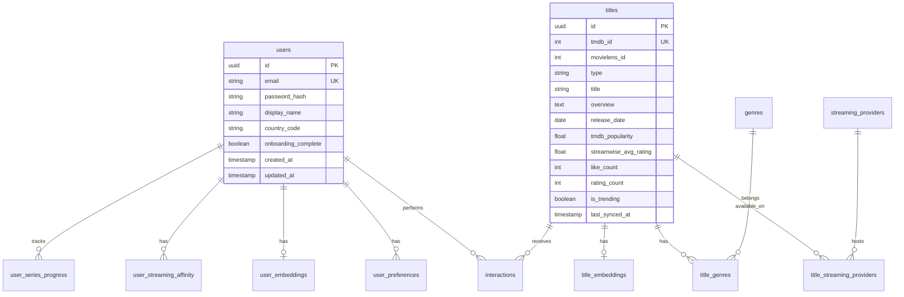

# Data Model: StreamWise Platform

**Feature**: `001-streamwise` | **Date**: 2026-06-11

PostgreSQL 16 schema with pgvector extension. UUIDs for primary keys unless noted.

---

## Entity Relationship Summary



---

## Tables

### `users`

| Column | Type | Constraints | Notes |
|---|---|---|---|
| id | UUID | PK, default gen_random_uuid() | |
| email | VARCHAR(255) | UNIQUE, NOT NULL | |
| password_hash | VARCHAR(255) | NULL | NULL if OAuth-only |
| display_name | VARCHAR(100) | NOT NULL | |
| country_code | CHAR(2) | NOT NULL, default 'BR' | |
| onboarding_complete | BOOLEAN | NOT NULL, default false | |
| created_at | TIMESTAMPTZ | NOT NULL | |
| updated_at | TIMESTAMPTZ | NOT NULL | |

**Validation**: Email format; password min 8 chars (application layer).

---

### `genres`

| Column | Type | Constraints |
|---|---|---|
| id | UUID | PK |
| name | VARCHAR(50) | UNIQUE, NOT NULL |
| tmdb_genre_id | INT | UNIQUE, nullable |

Seed from TMDB genre list + MovieLens genre strings.

---

### `titles`

| Column | Type | Constraints | Notes |
|---|---|---|---|
| id | UUID | PK | |
| tmdb_id | INT | UNIQUE, NOT NULL | External key |
| movielens_id | INT | UNIQUE, nullable | Training bridge |
| type | VARCHAR(10) | NOT NULL | `movie` \| `series` |
| title | VARCHAR(500) | NOT NULL | |
| overview | TEXT | | Synopsis |
| release_date | DATE | nullable | |
| poster_path | VARCHAR(255) | nullable | TMDB path |
| tmdb_popularity | FLOAT | default 0 | |
| streamwise_avg_rating | FLOAT | nullable | Computed aggregate |
| like_count | INT | NOT NULL, default 0 | Denormalized |
| rating_count | INT | NOT NULL, default 0 | |
| is_trending | BOOLEAN | default false | Set by sync job |
| is_new_release | BOOLEAN | default false | Set by sync job |
| last_synced_at | TIMESTAMPTZ | nullable | |

**Indexes**: `(is_trending)`, `(is_new_release)`, `(tmdb_popularity DESC)`.

---

### `title_genres`

| Column | Type | Constraints |
|---|---|---|
| title_id | UUID | FK → titles.id |
| genre_id | UUID | FK → genres.id |

**PK**: `(title_id, genre_id)`

---

### `streaming_providers`

| Column | Type | Constraints |
|---|---|---|
| id | UUID | PK |
| tmdb_provider_id | INT | UNIQUE, NOT NULL |
| name | VARCHAR(100) | NOT NULL |
| logo_path | VARCHAR(255) | nullable |

Examples: Netflix (8), Prime Video (119), Disney+ (337), Max (384).

---

### `title_streaming_providers`

| Column | Type | Constraints | Notes |
|---|---|---|---|
| title_id | UUID | FK → titles.id | |
| provider_id | UUID | FK → streaming_providers.id | |
| country_code | CHAR(2) | NOT NULL, default 'BR' | |
| availability_type | VARCHAR(20) | NOT NULL | `flatrate`, `rent`, `buy` |

**PK**: `(title_id, provider_id, country_code, availability_type)`

MVP UI prioritizes `flatrate` badges.

---

### `interactions`

| Column | Type | Constraints | Notes |
|---|---|---|---|
| id | UUID | PK | |
| user_id | UUID | FK → users.id | |
| title_id | UUID | FK → titles.id | |
| event_type | VARCHAR(20) | NOT NULL | See enum below |
| rating | FLOAT | nullable | 1.0–5.0 when event_type = `rating` |
| created_at | TIMESTAMPTZ | NOT NULL | |
| updated_at | TIMESTAMPTZ | NOT NULL | |

**event_type enum**: `like`, `dislike`, `rating`, `watchlist`, `watched`

**Unique constraint**: `(user_id, title_id, event_type)` for like/dislike/watchlist/watched; ratings allow update (upsert).

**Side effects** (application layer):
- Update `titles.like_count`, `streamwise_avg_rating` on write
- Trigger affinity recompute for user (async or inline MVP)

---

### `user_preferences`

| Column | Type | Constraints |
|---|---|---|
| user_id | UUID | FK → users.id |
| genre_id | UUID | FK → genres.id |
| source | VARCHAR(20) | `onboarding` \| `inferred` |

**PK**: `(user_id, genre_id, source)` — or simplify to `(user_id, genre_id)` for MVP.

---

### `user_streaming_affinity`

| Column | Type | Constraints |
|---|---|---|
| user_id | UUID | FK → users.id |
| provider_id | UUID | FK → streaming_providers.id |
| score | FLOAT | NOT NULL, 0.0–1.0 |

**PK**: `(user_id, provider_id)`

**Computation**:
```
score(provider) = likes_on_provider / total_likes
```
Normalized to sum ≈ 1.0 across providers; onboarding selections seed initial uniform weights.

---

### `title_embeddings`

| Column | Type | Constraints |
|---|---|---|
| title_id | UUID | PK, FK → titles.id |
| content_vector | vector(384) | pgvector; synopsis embedding |
| model_vector | vector(64) | nullable; Two-Tower item output |

**Index**: `USING ivfflat (content_vector vector_cosine_ops)` with lists=100 (tune after load).

---

### `user_embeddings`

| Column | Type | Constraints |
|---|---|---|
| user_id | UUID | PK, FK → users.id |
| profile_vector | vector(384) | nullable; aggregated content vectors of likes |
| model_vector | vector(64) | nullable; Two-Tower user output |

Updated after batch training or periodic job — not on every request for MVP.

---

### `user_series_progress` (P1)

| Column | Type | Constraints |
|---|---|---|
| user_id | UUID | FK → users.id |
| title_id | UUID | FK → titles.id |
| season | INT | NOT NULL |
| episode | INT | NOT NULL |
| updated_at | TIMESTAMPTZ | |

**PK**: `(user_id, title_id)`

Schema created in MVP migration but UI in P1.

---

### `model_versions`

| Column | Type | Constraints |
|---|---|---|
| id | UUID | PK |
| version | VARCHAR(50) | UNIQUE, NOT NULL |
| path | VARCHAR(500) | NOT NULL |
| is_active | BOOLEAN | default false | One active at a time |
| trained_at | TIMESTAMPTZ | NOT NULL |
| metrics | JSONB | nullable | precision@10, ndcg@10, etc. |

---

### `oauth_accounts` (optional, Google OAuth)

| Column | Type | Constraints |
|---|---|---|
| id | UUID | PK |
| user_id | UUID | FK → users.id |
| provider | VARCHAR(50) | NOT NULL |
| provider_account_id | VARCHAR(255) | NOT NULL |

**Unique**: `(provider, provider_account_id)`

---

## State Transitions

### User onboarding

```
registered → onboarding_incomplete → onboarding_complete
```

- `onboarding_complete = false` after register
- Set `true` after genres + streaming services saved (FR-008, FR-009)
- Optional seed likes create `interactions` with event_type `like`

### Interaction exclusivity

- `like` and `dislike` are mutually exclusive per (user, title) — upsert replaces prior
- `watched` excludes title from default recommendation candidate pool
- `watchlist` is independent of like

### Catalog sync

```
title discovered → upserted → providers synced → embedding generated (if new overview)
trending flags refreshed daily → is_trending / is_new_release updated
```

---

## Validation Rules (from spec)

| Rule | Enforcement |
|---|---|
| Rating 1–5 | API Pydantic ge=1, le=5 |
| Authenticated interactions | JWT required on interaction routes |
| BR providers only MVP | Sync job filters `watch/providers` region=BR |
| Exclude watched/disliked from feed | RecommendationService query filter |
| Community aggregates | Transactional update with interaction insert |

---

## Migration Strategy

1. `001_enable_pgvector.sql` — `CREATE EXTENSION vector`
2. `002_core_tables.sql` — users, genres, titles, providers, junctions
3. `003_interactions.sql` — interactions + aggregate triggers or app logic
4. `004_embeddings.sql` — embedding tables + indexes
5. `005_model_versions.sql`
6. Seed scripts: genres, streaming_providers from TMDB static lists

Alembic manages revisions under `apps/api/alembic/`.
