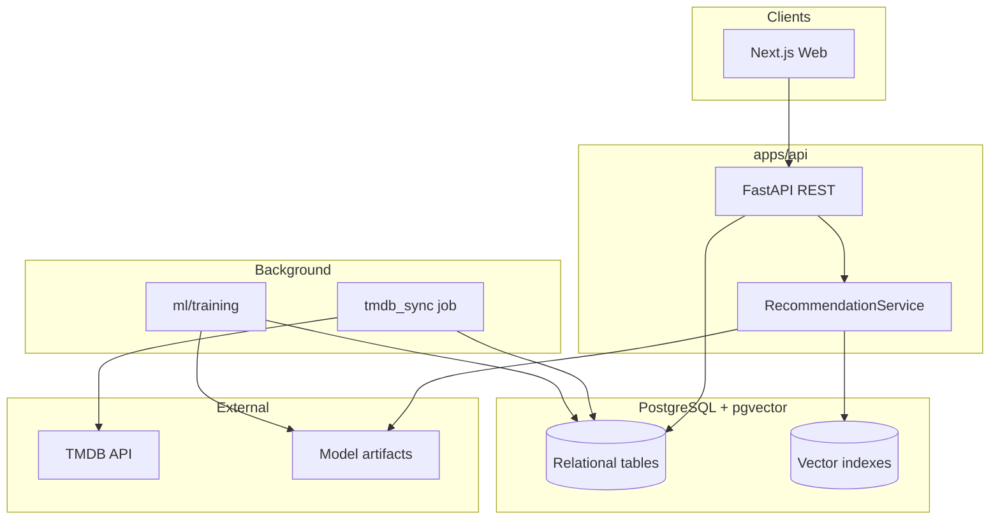

# Implementation Plan: StreamWise Platform

**Branch**: `001-streamwise` | **Date**: 2026-06-11 | **Spec**: [spec.md](./spec.md)

**Input**: Feature specification from `/specs/001-streamwise/spec.md`

## Summary

StreamWise is a movie/series discovery platform with authenticated users, a daily-refreshed catalog (TMDB, Brazil streaming availability), interaction tracking (likes, ratings, watchlist), and a hybrid personalized feed. Technically: **FastAPI** serves REST APIs; **PostgreSQL + pgvector** stores catalog, users, and embeddings; **Python/TensorFlow** trains a **Two-Tower** model offline on MovieLens + platform interactions; **Next.js** delivers the web UI. Recommendation flow: vector retrieval (~200 candidates) → neural ranking → streaming affinity rerank.

## Technical Context

**Language/Version**: Python 3.11+ (API, ML, jobs); TypeScript / Node 20+ (Next.js frontend)

**Primary Dependencies**: FastAPI, SQLAlchemy 2.x, Alembic, pgvector, httpx (TMDB client), TensorFlow/Keras 2.x, sentence-transformers, Next.js 14+, NextAuth.js, Tailwind CSS, APScheduler (or separate cron container)

**Storage**: PostgreSQL 16 with pgvector extension; local filesystem or object storage for model artifacts (MVP: `ml/artifacts/`)

**Testing**: pytest + httpx (API integration); pytest for ML eval scripts; Playwright optional for E2E (P1)

**Target Platform**: Linux (Docker Compose local dev); web browsers for frontend

**Project Type**: Web application (monorepo: API + web + ML pipelines)

**Performance Goals**: Home/trending API p95 < 500ms; "For you" feed p95 < 3s (SC-002); daily TMDB sync completes within 30 min for MVP catalog size

**Constraints**: Train/serve separation; no in-browser ML training; BR-only streaming providers in MVP; secrets via env vars

**Scale/Scope**: MVP target ~10k titles synced, hundreds of concurrent users; MovieLens 25M for offline training (subset sampling acceptable for dev)

## Constitution Check

*GATE: Must pass before Phase 0 research. Re-check after Phase 1 design.*

| Principle | Status | Notes |
|---|---|---|
| I. Discovery hub, not player | PASS | No video endpoints in API contract |
| II. Train/serve separation | PASS | `ml/training/` offline; API loads serialized model only |
| III. Hybrid recommendation | PASS | pgvector retrieval + Two-Tower rank documented in data-model and contracts |
| IV. Data sources (TMDB + MovieLens + interactions) | PASS | Sync job + import scripts defined |
| V. P0 before P1/P2 | PASS | Phased delivery in quickstart and tasks (future) |
| VI. ML quality gate | PASS | `ml/eval/` metrics vs popularity baseline |
| VII. Simplicity (monolith, Docker Compose) | PASS | No K8s/microservices in MVP |

**Post-design re-check**: All gates PASS. No constitution violations requiring Complexity Tracking entries.

## Project Structure

### Documentation (this feature)

```text
specs/001-streamwise/
├── plan.md              # This file
├── research.md          # Technology decisions
├── data-model.md        # Schema and entities
├── quickstart.md        # Local dev setup
├── contracts/
│   └── openapi.yaml     # REST API contract
└── tasks.md             # Created by /speckit-tasks (next step)
```

### Source Code (repository root)

```text
apps/
├── api/
│   ├── app/
│   │   ├── main.py
│   │   ├── config.py
│   │   ├── dependencies/
│   │   ├── routers/          # auth, catalog, interactions, recommendations
│   │   ├── services/         # tmdb, recommend, affinity
│   │   ├── models/           # SQLAlchemy ORM
│   │   └── schemas/          # Pydantic DTOs
│   ├── alembic/
│   ├── tests/
│   ├── pyproject.toml
│   └── Dockerfile
│
└── web/
    ├── src/
    │   ├── app/                # Next.js App Router pages
    │   ├── components/
    │   ├── lib/                # API client
    │   └── types/
    ├── tests/
    ├── package.json
    └── Dockerfile

ml/
├── training/
│   ├── train_two_tower.py
│   ├── import_movielens.py
│   ├── generate_embeddings.py
│   └── config.yaml
├── eval/
│   ├── evaluate.py             # Precision@10, NDCG@10
│   └── baselines.py
└── artifacts/                  # gitignored model versions

jobs/
└── tmdb_sync/
    ├── sync_catalog.py         # Daily trending + providers
    └── scheduler.py

infra/
├── docker-compose.yml
├── .env.example
└── postgres/init.sql           # pgvector extension

docs/
└── STREAMWISE-PLANNING.md

specs/001-streamwise/           # Spec Kit artifacts

legacy/                         # Optional: move old e-commerce TF.js demo
```

**Structure Decision**: Monorepo with `apps/api`, `apps/web`, `ml/`, and `jobs/` aligns with constitution train/serve split and keeps TMDB sync independent of request path. Legacy course code remains at root until migrated to `legacy/`.

## Architecture Overview



## Implementation Phases (P0 MVP)

| Phase | Deliverable | Maps to spec |
|---|---|---|
| **A** | Docker Compose, PostgreSQL+pgvector, Alembic schema | FR-004, FR-007 |
| **B** | Auth (JWT + optional Google OAuth), user CRUD | FR-001–FR-003 |
| **C** | TMDB sync job, catalog API (trending, detail) | FR-005, FR-006, FR-007 |
| **D** | Onboarding API, genres/providers seed | FR-008–FR-010 |
| **E** | Interactions API, aggregate ratings | FR-011–FR-015 |
| **F** | Synopsis embeddings + pgvector similar search | FR-022 |
| **G** | MovieLens import + Two-Tower train + model load | FR-016–FR-020 |
| **H** | Recommendation API (hybrid), streaming affinity | FR-019, FR-020 |
| **I** | Next.js UI (home, detail, feed, profile, onboarding) | All user stories |
| **J** | ML eval script + README architecture | SC-007, constitution VI |

P1 (post-MVP): MMR rerank, explainability tags, NL search, Tonight mode, series progress, ML dashboard — see `docs/STREAMWISE-PLANNING.md` §13.

## Key Design Decisions

See [research.md](./research.md) for full rationale.

1. **pgvector** over dedicated vector DB — single database for catalog + vectors simplifies MVP ops.
2. **Two-Tower** over legacy concat-MLP — aligns with portfolio goals and scales to retrieval+r rerank.
3. **TMDB** as sole catalog API — covers trending, metadata, and BR watch/providers.
4. **JWT sessions** via FastAPI; NextAuth on frontend delegating to API — standard BFF pattern.
5. **Batch affinity recompute** after interactions — simpler than real-time embedding updates for MVP.

## API Surface (summary)

Full contract: [contracts/openapi.yaml](./contracts/openapi.yaml)

| Area | Key endpoints |
|---|---|
| Auth | `POST /auth/register`, `POST /auth/login`, `POST /auth/oauth/google` |
| Catalog | `GET /catalog/trending`, `GET /catalog/new`, `GET /titles/{id}` |
| Onboarding | `PUT /users/me/preferences` |
| Interactions | `POST /titles/{id}/interactions` |
| Recommendations | `GET /recommendations/for-you`, `GET /titles/{id}/similar` |
| Profile | `GET /users/me`, `GET /users/me/likes`, `GET /users/me/watchlist`, `GET /users/me/affinity` |

## Recommendation Pipeline (runtime)

```
1. Load user profile, interactions, streaming_affinity
2. Build user context vector (onboarding + recent likes)
3. pgvector: top 200 candidates (content_vector similarity, exclude watched/disliked)
4. Two-Tower: score each candidate
5. Apply streaming boost: score_final = score * (1 + 0.3 * affinity[provider])
6. Sort, take top 20
7. Fallback: if model unavailable → genre-filtered trending + platform filter
```

## Environment Variables

| Variable | Purpose |
|---|---|
| `DATABASE_URL` | PostgreSQL connection |
| `TMDB_API_KEY` | Catalog sync |
| `JWT_SECRET` | Auth tokens |
| `GOOGLE_CLIENT_ID/SECRET` | OAuth (optional) |
| `MODEL_PATH` | Active Two-Tower artifact |
| `EMBEDDING_MODEL` | sentence-transformers model name |

## Complexity Tracking

> No constitution violations. Table intentionally empty.

| Violation | Why Needed | Simpler Alternative Rejected Because |
|-----------|------------|-------------------------------------|
| — | — | — |
